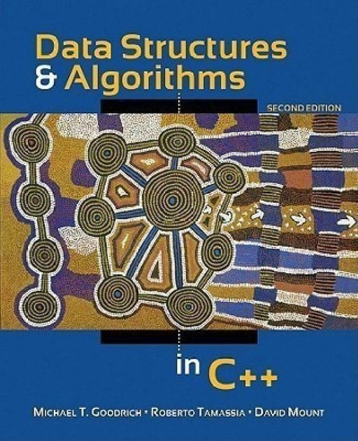

# _Data Structures and Algorithms using C++_
    
> Hello Learners,
>
>> I have started this project to learn DSA using C++ the hard way.
>> I believe the only way you can clearly understand, is when you do everything your self.
>> All beginners are welcome, and are free to contribute and help me solve the problems of this text book.

### Contributing rules!
* Code should have the clear documentation about what it is solving.
* Every question should be alloted a new file and there must be question at the start of the file.
* There should be there folders each for **Reinforcement**,  **Creativity** and **Projects**.

### _Data Structures and Algorithms in CPP is a book written by Goodrich Michael T._

### Chapters covered!

<!--**Chapter Number** | **Chapter Name** |-->
- [x] A C++ Primer
- [x] Object-Oriented Design
- [x] Arrays, Linked Lists, and Recursion
- [x] Analysis Tools
- [x] Stacks, Queues, and Deques
- [x] List and Iterator ADTs
- [ ] Trees *
- [ ] Heaps and Priority Queues
- [ ] Hash Tables, Maps, and Skip Lists
- [ ] Search Trees
- [ ] Sorting, Sets, and Selection
- [ ] Strings and Dynamic Programming
- [ ] Graph Algorithms
- [ ] Memory Management and B-Trees

* _(In progress)_ marked as *

__8 More chapter to cover!__
